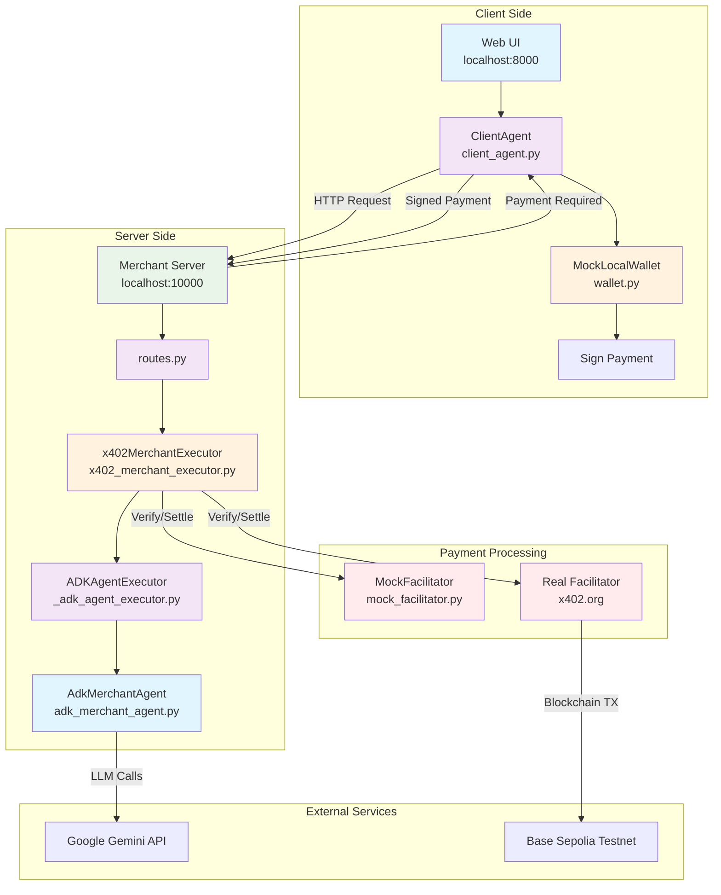

# ADK x402 Payment Protocol Demo

This project demonstrates a complete, end-to-end payment flow between two agents using the **A2A x402 Payment Protocol Extension**. It serves as a reference implementation for developers looking to add payment capabilities to their own agents.

The demo consists of two main components:
1.  A **Client Agent** that acts as an orchestrator, delegating tasks and handling the user-facing interaction.
2.  A **Merchant Server** that hosts a specialized agent capable of selling items and processing payments using the x402 protocol.

The reusable, core logic for the x402 protocol is encapsulated in the `x402_a2a` Python library, located in the `python/` directory of the parent repository.

## How to Run the Demo

### Prerequisites
- Python 3.13+
- `uv` (for environment and package management)
- Google API key (you can create one [here](https://ai.google.dev/gemini-api/docs/api-key))
- **For real payments**: CDP API credentials (optional, see Configuration section)

### 1. Setup the Environment
First, sync the virtual environment to install all necessary dependencies, including the local `x402_a2a` library in editable mode.

Run this command from the root of the `a2a-x402` repository:
```bash
uv sync --directory=examples/python/adk-demo
```

### 2. Configuration
Create a `.env` file in the `examples/python/adk-demo/` directory with the following variables:

```bash
# Required
GOOGLE_API_KEY=your_api_key_here

# Optional - Model Configuration
GEMINI_MODEL=gemini-1.5-flash  # Default: gemini-1.5-flash

# Optional - Facilitator Configuration
USE_MOCK_FACILITATOR=false     # Default: true (uses mock facilitator)
USE_MAINNET=false              # Default: false (uses testnet)

# Optional - For Real Payments (when USE_MOCK_FACILITATOR=false)
CDP_API_KEY_ID=your_cdp_key_id
CDP_API_KEY_SECRET=your_cdp_secret

# Optional - Wallet Configuration
CLIENT_PRIVATE_KEY=your_private_key_here
MERCHANT_WALLET_ADDRESS=your_merchant_wallet_address
```

> **Warning:** Do not hardcode or commit your API keys. The `.env` file is already included in `.gitignore`.

### 3. Start the Merchant Agent Server
The merchant server hosts the agent that sells products.

Run this command from the root of the `a2a-x402` repository:
```bash
uv --directory=examples/python/adk-demo run server
```
You should see logs indicating the server is running, typically on `localhost:10000`.

### 4. Start the Client Agent & Web UI
The client agent is an orchestrator that communicates with the merchant. The ADK provides a web interface to interact with it.

Run this command from the root of the `a2a-x402` repository:
```bash
uv --directory=examples/python/adk-demo run adk web --port=8000
```
This will start the ADK web server, usually on `localhost:8000`. Open this URL in your browser to interact with the client agent and start the purchase flow.

## Architectural Flow

The demo showcases a clean separation of concerns between the agent's business logic and the payment protocol logic.

1.  **Merchant-Side (Server):**
    - The `AdkMerchantAgent` contains the core business logic (e.g., providing product details). When payment is required, it doesn't handle any payment logic itself. Instead, it raises a `x402PaymentRequiredException`.
    - The `x402ServerExecutor` is a wrapper that intercepts this exception. It's responsible for all the server-side protocol logic: creating the `payment-required` response, receiving the client's signed payload, verifying it, and settling it.
    - This executor is "injected" in `routes.py`, wrapping the core `ADKAgentExecutor`.

2.  **Client-Side (`ClientAgent`):**
    - The `ClientAgent` acts as the user's proxy. Its `send_message` tool handles all communication.
    - When it receives a `payment-required` response from the merchant, it now prompts the user for confirmation.
    - Upon user confirmation, it calls its injected **Wallet** to sign the payment details.
    - It then uses the `x402Utils` from the core library to construct a valid `payment-submitted` message and sends it back to the merchant to finalize the purchase.

## Pluggable Components

A key design goal of this demo is to show how core components can be swapped out with real implementations.

### Facilitator
The `x402MerchantExecutor` requires a facilitator to verify and settle payments. The facilitator choice is controlled by the `USE_MOCK_FACILITATOR` environment variable (defaults to "true").

- When `USE_MOCK_FACILITATOR=true` (default), it uses a `MockFacilitator` (`mock_facilitator.py`) which approves all valid transactions, allowing you to test the payment flow without real transactions.
- When `USE_MOCK_FACILITATOR=false`, it uses a real `FacilitatorClient` with a provided `FacilitatorConfig` to process actual onchain transactions.

To use a real payment processor, set `USE_MOCK_FACILITATOR=false` and provide a valid `FacilitatorConfig`.

### Wallet
The `ClientAgent` does not handle signing directly. Instead, it depends on a `Wallet` interface (`wallet.py`). This makes the signing mechanism fully pluggable.

In the demo, we inject a `MockLocalWallet` which signs transactions using a private key from the `CLIENT_PRIVATE_KEY` environment variable. To connect to a real system, a developer could implement:
- A wallet that connects to a browser extension like MetaMask.
- A wallet that calls out to a secure MPC (Multi-Party Computation) service.
- A wallet that communicates with a hardware signing device.

This architecture ensures that the agent's orchestration logic remains completely separate from the specifics of payment signing.

## Architecture Overview

### System Workflow



### File Structure & Responsibilities

#### **Client Side Files**

**`client_agent/client_agent.py`**
- **Role**: Main orchestrator that handles user interactions
- **Key Features**:
  - Manages conversation flow with the merchant
  - Handles payment confirmation prompts
  - Delegates payment signing to wallet
  - Constructs and sends payment responses
- **Dependencies**: `wallet.py`, `x402_a2a` library

**`client_agent/wallet.py`**
- **Role**: Payment signing interface
- **Key Features**:
  - Implements `Wallet` interface for pluggable signing
  - Signs payment requirements using private key
  - Supports environment variable configuration
  - Can be replaced with MetaMask, hardware wallets, etc.
- **Dependencies**: `eth_account`, `x402_a2a` library

#### **Server Side Files**

**`server/agents/routes.py`**
- **Role**: HTTP routing and agent orchestration
- **Key Features**:
  - Creates HTTP routes for each agent
  - Wraps agents with appropriate executors
  - Handles A2A protocol communication
  - Manages session and memory services
- **Dependencies**: All agent files, `x402MerchantExecutor`

**`server/agents/x402_merchant_executor.py`**
- **Role**: Payment protocol middleware
- **Key Features**:
  - Intercepts `x402PaymentRequiredException`
  - Handles payment verification and settlement
  - Manages facilitator selection (mock vs real)
  - Centralizes payment configuration logic
- **Dependencies**: `x402_a2a` library, facilitator implementations

**`server/agents/_adk_agent_executor.py`**
- **Role**: ADK agent execution wrapper
- **Key Features**:
  - Executes the actual LLM agent
  - Handles streaming responses
  - Manages agent lifecycle
  - Provides debugging and logging
- **Dependencies**: Google ADK, `AdkMerchantAgent`

**`server/agents/adk_merchant_agent.py`**
- **Role**: Core business logic for merchant
- **Key Features**:
  - Defines product catalog and pricing
  - Implements merchant conversation logic
  - Raises payment exceptions when needed
  - Configurable via environment variables
- **Dependencies**: Google ADK, `x402_a2a` library

**`server/agents/mock_facilitator.py`**
- **Role**: Mock payment facilitator for testing
- **Key Features**:
  - Approves all valid payment requests
  - Returns mock settlement responses
  - No real blockchain interaction
  - Perfect for development and testing
- **Dependencies**: `x402_a2a` library

#### **Configuration Files**

**`.env`**
- **Role**: Environment configuration
- **Key Variables**:
  - `GOOGLE_API_KEY`: Required for Gemini API
  - `USE_MOCK_FACILITATOR`: Toggle between mock/real facilitator
  - `CLIENT_PRIVATE_KEY`: Wallet private key for signing
  - `MERCHANT_WALLET_ADDRESS`: Merchant's wallet address
  - `GEMINI_MODEL`: LLM model selection

### Data Flow

1. **User Request**: User types message in web UI
2. **Client Processing**: `ClientAgent` processes request and sends to merchant
3. **Merchant Response**: `AdkMerchantAgent` generates response, may raise payment exception
4. **Payment Handling**: `x402MerchantExecutor` catches exception, creates payment request
5. **User Confirmation**: Client prompts user for payment confirmation
6. **Payment Signing**: `MockLocalWallet` signs payment with private key
7. **Payment Submission**: Client sends signed payment back to merchant
8. **Verification**: `x402MerchantExecutor` verifies payment with facilitator
9. **Settlement**: Facilitator settles payment (mock or real blockchain)
10. **Response**: Merchant sends final confirmation to client

## Recent Updates

This demo has been enhanced with the following improvements:

- **Real Facilitator Integration**: Support for both mock and real x402 facilitators
- **Environment Variable Configuration**: All settings configurable via `.env` file
- **Model Flexibility**: Configurable Gemini model selection (defaults to gemini-1.5-flash)
- **Testnet/Mainnet Support**: Easy switching between testnet and mainnet
- **Improved Architecture**: Cleaner separation of facilitator configuration logic
- **Testing-Friendly Pricing**: Reduced product prices for easier testing with limited funds

## Expected Output

When the demo runs successfully, you'll see different responses depending on your facilitator configuration:

### Mock Facilitator (USE_MOCK_FACILITATOR=true)
When using the mock facilitator, you'll see a successful settlement with mock data:

```
✅ Payment Settled!
INFO:x402_a2a.executors.server:Settlement response: {
  "success": true,
  "error_reason": null,
  "transaction": null,
  "network": "mock-network",
  "payer": null
}
```

### Real Testnet Facilitator (USE_MOCK_FACILITATOR=false)
When using the real facilitator on testnet, you'll see actual blockchain transaction details:

```
✅ Payment Settled!
INFO:x402_a2a.executors.server:Settlement response: {
  "success": true,
  "error_reason": null,
  "transaction": "YOUR_TRANSACTION_HASH",
  "network": "base-sepolia",
  "payer": "YOUR_WALLET_ADDRESS"
}
```

### What This Means
- **Mock Mode**: Perfect for testing the payment flow without real transactions
- **Testnet Mode**: Real blockchain transactions on Base Sepolia testnet
- **Transaction Hash**: You can verify the transaction on [Base Sepolia Explorer](https://sepolia.basescan.org/)
- **Payer Address**: The wallet address that signed the payment

### Troubleshooting
If you see `⛔ Payment failed verification` with `"insufficient_funds"`, check:
1. Your wallet has enough testnet USDC
2. The product price is within your balance
3. You're using the correct private key for you wallet address in `CLIENT_PRIVATE_KEY`
